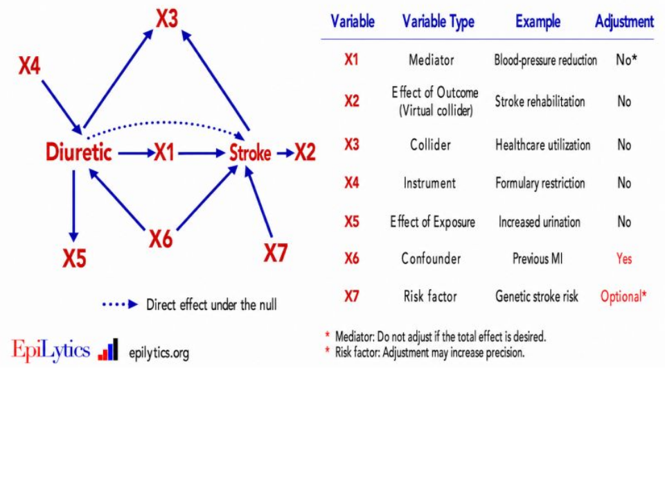

## Setup {#sec-setup}

- [Original paper](https://osf.io/8vcxh/overview)

Before running the script of your choice (either a `.R` or a `.Rmd` / `.qmd` script) check that you defined the data-generating function `dgp(beta1, restrict, n)`, the parameter values for `beta1` and `n`, and the model formula, and that you received the `Helper.R` script. This script incorporates multiple validation checks for the confirmatory study to verify that all restrictions are met and that every component is correctly specified. It additionally provides a fixed seed for the simulations and contains the complete code used to perform the simulations and compute the effect size estimates, relative bias and power. Code to represent the results is also provided in this script.

You are encouraged to include comments in your code, especially in the exploratory section.
If the script does not run and there are no error messages check again the upper rules for the `dgp(beta1, restrict, n)` function.
If you do not find the problem, feel free to contact us: [multi.analyst@stat.uni-muenchen.de](mailto:multi.analyst@stat.uni-muenchen.de){.email}

```{r setup}
# execute-dir: file → chapter cwd is scripts/
source("Helper.R")

# Helper.R writes fixed PNG names; rename after each scenario
rename_sim_figures <- function(tag) {
  mapping <- c(
    "Mean relative bias for convenience sample restricted on X.png" = sprintf(
      "Mean relative bias restricted on X (%s).png",
      tag
    ),
    "Mean relative bias for convenience sample restricted on Y.png" = sprintf(
      "Mean relative bias restricted on Y (%s).png",
      tag
    ),
    "Power Plot.png" = sprintf("Power Plot (%s).png", tag)
  )
  for (from in names(mapping)) {
    if (file.exists(from)) {
      file.rename(from, mapping[[from]])
    }
  }
  invisible(tag)
}
```

Without a thin wrapper, each Monte Carlo scenario would repeat the same four confirmatory steps (`checks()`, `run_simulations()`, `simulation_results()`, `power()`) plus renaming of the fixed PNG filenames that `Helper.R` writes. The listing below packages that pipeline so every DGP only needs its function and a figure tag, while still receiving all design parameters as explicit arguments (no reliance on the calling environment).

```{r}
#| label: lst-run-scenario
#| lst-cap: "run_scenario() — confirmatory checks, Monte Carlo, bias/power plots, and figure renaming for one DGP."
run_scenario <- function(
  dgp_fun,
  tag,
  niter = 100L,
  beta1 = c(0.2, 0.5, 0.8),
  restrict = c("none", "weak", "moderate", "strong"),
  n = 100L,
  formula = y ~ x
) {
  checks(niter, beta1, restrict, n, formula, dgp_fun)
  sim_out <- run_simulations(niter, beta1, restrict, n, formula, dgp_fun)
  simulation_results(sim_out, restrict)
  power(sim_out)
  rename_sim_figures(tag)
  invisible(sim_out)
}
```

## Confirmatory part {#sec-confirmatory}

### Sampling process (DAG)

We follow [Supplement S1](../biblio/Supplement%20S1.pdf) and represent convenience sampling with a selection indicator $S$, where $S = 1$ if an observation is retained. The **selection process** shapes which values of $X$ enter the convenience sample ($S \to X$). The structural model for $Y$ remains $X \to Y$.

For **probabilistic restriction on $X$**,

$$
P(S = 1 \mid X, Y) = P(S = 1 \mid X) = \operatorname{logit}^{-1}(\alpha + \gamma\, X).
$$

Stronger restriction corresponds to larger $|\gamma|$. Because selection depends on $X$ only, $S \perp Y \mid X$, which leaves the unstandardized slope $\beta_1$ unbiased (Hypothesis 1).

```{mermaid}
%%| label: fig-sampling-dag
%%| fig-cap: "Selection DAG: S influences the observed distribution of X; X influences Y (colours: predictor, outcome, selection)."
flowchart LR
  S["S (selection)"] --> X["X (predictor)"]
  X --> Y["Y (outcome)"]
  classDef predictor fill:#4C78A8,color:#fff,stroke:#333
  classDef outcome fill:#F58518,color:#fff,stroke:#333
  classDef selection fill:#54A24B,color:#fff,stroke:#333
  class X predictor
  class Y outcome
  class S selection
```

### DGP

Continuous predictor $X \sim \mathcal{N}(0,1)$, outcome
$Y = \beta_0 + \beta_1 X + \varepsilon$ with $\varepsilon \sim \mathcal{N}(0, \sigma^2)$.
When `restrict == "none"`, both returned samples are identical unrestricted draws of size $n$.

##### Probabilistic restriction (logistic)

Restriction levels `"weak"`, `"moderate"`, `"strong"` use increasing logistic slopes $\gamma$ (preferring larger values of the restricted variable, analogous to a high-$X$ convenience sample).

```{r dgp}
dgp <- function(
  beta1,
  restrict = c("none", "weak", "moderate", "strong"),
  n,
  beta0 = 0,
  sigma = 1,
  pool_mult = 40L
) {
  restrict <- match.arg(restrict)

  # logistic slope: larger |gamma| -> stronger range restriction
  gamma <- switch(
    restrict,
    none = 0,
    weak = 0.75,
    moderate = 1.75,
    strong = 3.5
  )
  # intercept: with X~N(0,1), plogis(alpha) ≈ marginal selection rate when gamma=0
  alpha <- -1.2

  draw_population <- function(n) {
    x <- rnorm(n)
    y <- beta0 + beta1 * x + rnorm(n, sd = sigma)
    data.frame(x = x, y = y)
  }

  # One-shot pool: draw n * pool_mult, keep selected rows, take first n
  sample_selected <- function(score_fun, n) {
    if (isTRUE(all.equal(gamma, 0))) {
      return(draw_population(n))
    }
    pop <- draw_population(as.integer(n * pool_mult))
    keep <- runif(nrow(pop)) < plogis(alpha + gamma * score_fun(pop))
    sel <- pop[keep, , drop = FALSE]
    if (nrow(sel) < n) {
      stop(
        "Could not obtain n selected observations; ",
        "try a larger pool_mult or weaker gamma."
      )
    }
    sel[seq_len(n), , drop = FALSE]
  }

  if (restrict == "none") {
    df <- draw_population(n)
    return(list(convenience_x = df, convenience_y = df))
  }

  # restrict by X: P(S=1 | X)
  convenience_x <- sample_selected(function(df) df$x, n)
  # restrict by Y: P(S=1 | Y) — required by confirmatory template / Helper.R
  convenience_y <- sample_selected(function(df) df$y, n)

  list(convenience_x = convenience_x, convenience_y = convenience_y)
}
```

Illustrative inclusion curves:

```{r illustrate-restriction, fig.cap="Probabilistic inclusion curves P(S=1|X) for weak / moderate / strong restriction."}
x_grid <- seq(-3.5, 3.5, length.out = 200)
alpha_ill <- -1.2
gammas <- c(weak = 0.75, moderate = 1.75, strong = 3.5)
incl <- data.frame(
  x = rep(x_grid, length(gammas)),
  level = factor(
    rep(names(gammas), each = length(x_grid)),
    levels = names(gammas)
  ),
  p = unlist(lapply(gammas, function(g) plogis(alpha_ill + g * x_grid)))
)
ggplot(incl, aes(x = x, y = p, colour = level)) +
  geom_line(linewidth = 1) +
  labs(
    x = expression(X),
    y = expression(P(S == 1 ~ "|" ~ X)),
    colour = "Restriction",
    title = "Logistic selection on continuous X"
  ) +
  theme_minimal()
```

##### Deterministic restriction (sinusoidal)

As an alternative **deterministic** mechanism, we retain observations when a sinusoidal score exceeds a cutoff on the restricted variable:

$$
\sin(\omega\, v) > c,
$$

with $v = X$ for `convenience_x` and $v = Y$ for `convenience_y`. Larger $\omega$ or $c$ yield stronger restriction by narrowing the retained bands on the real line.

```{r dgp-deterministic}
dgp_det <- function(
  beta1,
  restrict = c("none", "weak", "moderate", "strong"),
  n,
  beta0 = 0,
  sigma = 1,
  pool_mult = 60L
) {
  restrict <- match.arg(restrict)

  omega <- switch(
    restrict,
    none = 0,
    weak = 1,
    moderate = 2,
    strong = 3
  )
  cutoff <- switch(
    restrict,
    none = -Inf,
    weak = -0.35,
    moderate = 0.05,
    strong = 0.45
  )

  draw_population <- function(n) {
    x <- rnorm(n)
    y <- beta0 + beta1 * x + rnorm(n, sd = sigma)
    data.frame(x = x, y = y)
  }

  sample_deterministic <- function(value_fun, n) {
    if (restrict == "none") {
      return(draw_population(n))
    }
    pop <- draw_population(as.integer(n * pool_mult))
    keep <- sin(omega * value_fun(pop)) > cutoff
    sel <- pop[keep, , drop = FALSE]
    if (nrow(sel) < n) {
      stop(
        "Could not obtain n deterministic selections; ",
        "try a larger pool_mult or weaker cutoff."
      )
    }
    sel[seq_len(n), , drop = FALSE]
  }

  if (restrict == "none") {
    df <- draw_population(n)
    return(list(convenience_x = df, convenience_y = df))
  }

  list(
    convenience_x = sample_deterministic(function(df) df$x, n),
    convenience_y = sample_deterministic(function(df) df$y, n)
  )
}
```

```{r illustrate-deterministic, fig.cap="Deterministic sinusoidal inclusion regions sin(omega * X) > c on the X scale."}
x_grid <- seq(-3.5, 3.5, length.out = 400)
spec <- data.frame(
  level = factor(
    rep(c("weak", "moderate", "strong"), each = length(x_grid)),
    levels = c("weak", "moderate", "strong")
  ),
  x = rep(x_grid, 3),
  omega = rep(c(1, 2, 3), each = length(x_grid)),
  cutoff = rep(c(-0.35, 0.05, 0.45), each = length(x_grid))
)
spec$score <- sin(spec$omega * spec$x)
spec$included <- spec$score > spec$cutoff

ggplot(spec, aes(x = x, y = score, colour = level)) +
  geom_line(linewidth = 1) +
  geom_ribbon(
    data = subset(spec, included),
    aes(ymin = cutoff, ymax = score, fill = level),
    alpha = 0.15,
    colour = NA
  ) +
  geom_hline(
    data = unique(spec[, c("level", "cutoff")]),
    aes(yintercept = cutoff, colour = level),
    linetype = "dashed"
  ) +
  labs(
    x = expression(X),
    y = expression(sin(omega * X)),
    colour = "Restriction",
    fill = "Restriction",
    title = "Deterministic sinusoidal selection on X"
  ) +
  theme_minimal()
```

### Effect size

Three non-zero slopes (weak / moderate / strong association) with $X\sim\mathcal{N}(0,1)$ and $\sigma=1$:

```{r eff_size}
beta1 <- c(0.2, 0.5, 0.8)
```

### Number of observations per sample

We focus on small sample sizes, so $n$ is set to $100$:

```{r n}
n <- 100L
```

### Model formula

```{r model_formula}
formula <- y ~ x
```


### Results of the Monte Carlo design

This section repeats your data-generating procedure for $n_{\mathrm{iter}}$ Monte Carlo iterations (defined as `niter`; by default this is set to 10,000, although we recommend using 100 for testing purposes).
This will estimate the variability and bias of your effect size measures across repeated samples. To obtain the results, simply run the sections below.

**Run the checks:** Before running the full simulation, execute the `checks()` function.
If no errors or warnings occur, your DGP is valid and you can proceed with the simulation.

**Run the simulation:** Once the checks pass, use the `run_simulations()` function to perform the Monte Carlo iterations. The wrapper collects per-iteration results and then computes summary quantities across iterations (mean relative bias, Monte Carlo standard error of the mean, and 95% simulation interval).

```{r iterate}
niter <- 100
```

**Represent the results:** Run the two following functions. `simulation_results()` returns two
figures showing the results for sample restriction of $X$ and $Y$, respectively.
Note: the Pearson correlation coefficient is only derived for a numeric $X$ and Cohen's $d$ only for a binary $X$.
The function `power()` returns a figure displaying the power for the unrestricted sample and the convenience samples.
All figures will be saved in the same folder where your `Helper.R` script is located. Please send us your completed script along with the three resulting figures and the `sessionInfo()` text file generated at the end of your script.

#### Probabilistic (logistic) selection

```{r render-summary-logistic}
sim <- run_scenario(
  dgp,
  "logistic",
  niter = niter,
  beta1 = beta1,
  restrict = restrict,
  n = n,
  formula = formula
)
```

#### Deterministic (sinusoidal) selection

```{r render-summary-deterministic}
sim_det <- run_scenario(
  dgp_det,
  "sinusoidal",
  niter = niter,
  beta1 = beta1,
  restrict = restrict,
  n = n,
  formula = formula
)
```

### Conclusion (confirmatory)

Across both the probabilistic (logistic) and deterministic (sinusoidal) convenience-sampling mechanisms, the Monte Carlo results tend to confirm that **selection on the predictor $X$ does not modify the unstandardised main-effect estimate $\beta_1$**. This is expected from the DAG $X \to Y$ with $S$ a child of $X$ only: given $X$, selection carries no additional information about $Y$, so $S \perp Y \mid X$.

The same conclusion follows from the **Markov property** of a Bayesian network compatible with a DAG $\mathcal{G}$ [@sucarProbabilisticGraphicalModels2021]: each vertex $X_i$ is independent of its non-descendants given its parents,

$$
X \perp\!\!\!\perp \bigl(\operatorname{nondesc}(X) \setminus pa(X)\bigr) \mid pa(X),
$$

and the joint factorises as

$$
P(X_1,\ldots,X_n) = \prod_{i=1}^{n} P(X_i \mid pa(X_i)).
$$

Conditioning on the predictor therefore blocks paths through $S$, leaving the structural slope $\beta_1$ (the coefficient in $Y \mid X$) unchanged under convenience sampling on $X$.

::: {.callout-important}
## Take-home (confirmatory)

Convenience sampling that depends on $X$ alone redistributes the observed design of $X$, but—by the DAG Markov property—does **not** bias the unstandardised OLS slope $\beta_1$ of $Y$ on $X$. Bias appears when selection opens new dependence (e.g. colliders) or when unobserved common causes $U$ are left unadjusted (confounding).
:::

## Exploratory part {#sec-exploratory}

In the exploratory part, you are free to extend the confirmatory simulations with any settings you
consider relevant or interesting. There are no restrictions on the data-generating process (DGP) or
the types of violations you introduce (e.g., model misspecification, nonlinearity, measurement error, etc.). Please document your implementation and design choices in a short written report.
You may, however, reuse the functions in `Helper.R` to the extent that your exploratory design remains compatible with their assumptions.

**When you can use `run_simulations()`:** The function `run_simulations()` can be used as long
as the following arguments are specified in the required format:

- `niter`: an integer giving the number of Monte Carlo iterations.
- `beta1`: a numeric vector of length three, specifying the true effect sizes to be evaluated.
- `restrict`: a character vector containing the four restriction levels `"none"`, `"weak"`, `"moderate"`, and `"strong"`.
- `n`: an integer specifying the sample size per simulated dataset.
- `formula`: an R formula specifying the analysis model (e.g., `y ~ x + z`).
- `dgp_fun`: a data-generating function of the form `dgp_fun(beta1, restrict, n)` as described above, which returns the required samples (unrestricted, restricted on $X$, restricted on $Y$) in the same structure as in the confirmatory part.

Within this framework, you may modify the DGP quite freely, for example, by introducing heteroscedastic errors, nonlinear terms, effect modification, or measurement error, provided that the arguments and output structure expected by `run_simulations()` and `one_simulation_run()` are preserved.

**When the Helper functions are no longer sufficient:** The current Helper functions are tailored to the effect size measures used in the confirmatory part (unstandardized and standardized regression coefficients, Pearson's $r$, Cohen's $d$, $R^2$) and the corresponding confidence intervals and power. If, in your exploratory analyses, you wish to:

- derive additional effect size measures (e.g., Spearman rank correlation, odds ratios, partial correlations), or
- focus on other performance metrics (e.g., predictive performance, calibration measures, classification accuracy),

then you will need to implement the computation of these quantities yourself (e.g., by extending `model_function()`, adding new summary code, or writing separate analysis functions). In such cases, `run_simulations()` and the plotting functions (`simulation_results()`, `power()`) may serve as templates, but will not automatically handle the new measures without modification.

We explore four confirmatory violations below. Each scenario keeps the `Helper.R` API (`dgp_*(beta1, restrict, n)` returning `convenience_x` / `convenience_y`) and reports mean relative bias and power via `simulation_results()` and `power()`.

### i) $S$ as a collider (selection-induced endogeneity)

Before selection, $X \perp \varepsilon$ and $E[\varepsilon \mid X] = 0$. If $S$ depends jointly on $X$ and $\varepsilon$, then $S$ is a **collider** on the path $X \to S \leftarrow \varepsilon$, and conditioning on $S = 1$ induces $\operatorname{Cov}(X, \varepsilon \mid S = 1) \neq 0$ (selection-induced endogeneity). Contrast with selection on $X$ alone, which preserves exogeneity.

Without selection the joint covariance is block-diagonal:

$$
\operatorname{Cov}\begin{pmatrix} X \\ \varepsilon \end{pmatrix}
=
\begin{pmatrix} \Sigma_X & 0 \\ 0 & \sigma_\varepsilon^2 \end{pmatrix}.
$$

With $\pi(x,e) = P(S=1 \mid X=x, \varepsilon=e)$ and $p_S = E[\pi(X,\varepsilon)]$,

$$
\operatorname{Cov}(X,\varepsilon \mid S=1)
=
\frac{E[X\varepsilon\pi]}{p_S}
-
\frac{E[X\pi]\,E[\varepsilon\pi]}{p_S^2},
$$

which is zero if $\pi = \pi(X)$ only, but generally nonzero if $\pi$ depends on both $X$ and $\varepsilon$. Equivalently, $E[\varepsilon \mid X, S=1] = m_S(X)$ need not be zero, so $\operatorname{Cov}(X,\varepsilon \mid S=1) = \operatorname{Cov}(X, m_S(X) \mid S=1)$.

Concrete threshold example: $S = \mathbf{1}\{\alpha + \beta X + \varepsilon > 0\}$ yields a truncated-Gaussian error with inverse Mills ratio $\lambda$, hence $\operatorname{Cov}(X,\varepsilon \mid S=1) = \sigma_\varepsilon \operatorname{Cov}(X, \lambda(a(X)) \mid S=1)$.

```{mermaid}
%%| label: fig-collider
%%| fig-cap: "Collider / selection-induced endogeneity: X and ε are independent a priori; conditioning on S opens the path."
flowchart LR
  X["X (predictor)"] --> S["S (selection)"]
  E["ε (residual)"] --> S
  X --> Y["Y (outcome)"]
  E --> Y
  classDef predictor fill:#4C78A8,color:#fff,stroke:#333
  classDef outcome fill:#F58518,color:#fff,stroke:#333
  classDef residual fill:#E45756,color:#fff,stroke:#333
  classDef selection fill:#54A24B,color:#fff,stroke:#333
  class X predictor
  class Y outcome
  class E residual
  class S selection
```

{#fig-adjustment-svg}

```{r exploratory-collider}
# S depends jointly on X and epsilon -> endogenous slope after selection
dgp_collider <- function(
  beta1,
  restrict = c("none", "weak", "moderate", "strong"),
  n,
  beta0 = 0,
  sigma = 1,
  pool_mult = 50L
) {
  restrict <- match.arg(restrict)
  # strength of the epsilon path into S (joint selection)
  gamma_x <- switch(
    restrict,
    none = 0,
    weak = 0.5,
    moderate = 1.2,
    strong = 2.5
  )
  gamma_e <- switch(
    restrict,
    none = 0,
    weak = 0.5,
    moderate = 1.2,
    strong = 2.5
  )
  alpha <- -0.8

  draw_one <- function(n) {
    x <- rnorm(n)
    eps <- rnorm(n, sd = sigma)
    y <- beta0 + beta1 * x + eps
    data.frame(x = x, y = y, eps = eps)
  }

  sample_joint <- function(n, on_y = FALSE) {
    if (restrict == "none") {
      return(draw_one(n)[, c("x", "y")])
    }
    pop <- draw_one(as.integer(n * pool_mult))
    # joint selection: logit depends on (x, eps) or (y, eps)
    score <- if (on_y) {
      gamma_x * pop$y + gamma_e * pop$eps
    } else {
      gamma_x * pop$x + gamma_e * pop$eps
    }
    keep <- runif(nrow(pop)) < plogis(alpha + score)
    sel <- pop[keep, c("x", "y"), drop = FALSE]
    if (nrow(sel) < n) {
      stop("Collider DGP: not enough selected rows.")
    }
    sel[seq_len(n), , drop = FALSE]
  }

  if (restrict == "none") {
    df <- draw_one(n)[, c("x", "y")]
    return(list(convenience_x = df, convenience_y = df))
  }

  list(
    convenience_x = sample_joint(n, on_y = FALSE),
    convenience_y = sample_joint(n, on_y = TRUE)
  )
}

# illustrate induced Cov(X, eps | S=1)
set.seed(1)
pop <- {
  x <- rnorm(20000)
  eps <- rnorm(20000)
  data.frame(x = x, eps = eps, y = 0.5 * x + eps)
}
pop$p <- plogis(-0.8 + 1.2 * pop$x + 1.2 * pop$eps)
sel <- pop[runif(nrow(pop)) < pop$p, ]
cat(
  "Cov(X, eps) before selection: ",
  round(cov(pop$x, pop$eps), 4),
  "\nCov(X, eps) | S=1:            ",
  round(cov(sel$x, sel$eps), 4),
  "\n",
  sep = ""
)
```

##### Mean relative bias and power (collider)

```{r exploratory-collider-results}
sim_col <- run_scenario(
  dgp_collider,
  "collider",
  niter = niter,
  beta1 = beta1,
  restrict = restrict,
  n = n,
  formula = formula
)
```

### ii) $S$ as a confounder

Here a latent common cause $U$ (unobserved, in the usual causal notation) drives both the predictor and the outcome (fork $X \leftarrow U \rightarrow Y$), while the dashed path $X \dashrightarrow Y$ is the target association. Selection $S$ that depends on $U$ (e.g. hospital / clinic recruitment) acts as a **confounder pathway** into the observed sample: restricting on $S$ changes the distribution of $U$ and thereby biases the naive $X$–$Y$ association if $U$ is omitted from the analysis model.

```{mermaid}
%%| label: fig-confounder
%%| fig-cap: "Confounding fork: U is an unobserved common cause of X and Y; S depends on U (selection into the study)."
flowchart TB
  U["U (unobserved common cause)"] --> X["X (predictor)"]
  U --> Y["Y (outcome)"]
  X -.->|"target association"| Y
  U --> S["S (selection)"]
  classDef predictor fill:#4C78A8,color:#fff,stroke:#333
  classDef outcome fill:#F58518,color:#fff,stroke:#333
  classDef selection fill:#54A24B,color:#fff,stroke:#333
  classDef latent fill:#B279A2,color:#fff,stroke:#333
  class X predictor
  class Y outcome
  class S selection
  class U latent
```

```{r exploratory-confounder}
dgp_confounder <- function(
  beta1,
  restrict = c("none", "weak", "moderate", "strong"),
  n,
  beta0 = 0,
  sigma = 1,
  beta_u = 0.8,
  pool_mult = 40L
) {
  restrict <- match.arg(restrict)
  gamma <- switch(
    restrict,
    none = 0,
    weak = 0.75,
    moderate = 1.75,
    strong = 3.5
  )
  alpha <- -1.2

  draw_population <- function(n) {
    u <- rnorm(n)
    x <- 0.7 * u + rnorm(n, sd = 0.7)
    y <- beta0 + beta1 * x + beta_u * u + rnorm(n, sd = sigma)
    data.frame(x = x, y = y, u = u)
  }

  sample_on_u <- function(n) {
    if (restrict == "none") {
      return(draw_population(n)[, c("x", "y")])
    }
    pop <- draw_population(as.integer(n * pool_mult))
    keep <- runif(nrow(pop)) < plogis(alpha + gamma * pop$u)
    sel <- pop[keep, c("x", "y"), drop = FALSE]
    if (nrow(sel) < n) {
      stop("Confounder DGP: not enough selected rows.")
    }
    sel[seq_len(n), , drop = FALSE]
  }

  if (restrict == "none") {
    df <- draw_population(n)[, c("x", "y")]
    return(list(convenience_x = df, convenience_y = df))
  }

  # both samples: selection on U (confounder), not on X or Y alone
  df <- sample_on_u(n)
  list(convenience_x = df, convenience_y = df)
}
```

##### Mean relative bias and power (confounder)

```{r exploratory-confounder-results}
sim_cnf <- run_scenario(
  dgp_confounder,
  "confounder",
  niter = niter,
  beta1 = beta1,
  restrict = restrict,
  n = n,
  formula = formula
)
```

### iii) Linear mixed model with group-level selection

**Linear mixed / multilevel models** address dependence and heterogeneity. For observations $i$ in groups $j$ (e.g. patients in hospitals),

$$
Y_{ij} = \beta_0 + \beta_1 X_{ij} + b_j + \varepsilon_{ij},
\qquad
b_j \sim \mathcal{N}(0, \tau^2),
\qquad
\varepsilon_{ij} \sim \mathcal{N}(0, \sigma^2).
$$

Marginally, $\operatorname{Cov}(Y_{ij}, Y_{kj} \mid X) = \tau^2$ for $i \neq k$: the random effect induces within-group dependence. In matrix form, $\operatorname{Var}(Y \mid X) = ZDZ^\top + R$.

Here **selection acts on groups**: $S$ retains hospitals according to a logistic function of the random effect $b_j$, so convenience samples over-represent extreme cluster effects. The analysis below still uses the confirmatory OLS formula `y ~ x` (ignoring clustering), which is the misspecification of interest under group-level convenience sampling.

```{mermaid}
%%| label: fig-mixed-selection
%%| fig-cap: "Linear mixed DGP with group-level selection: S depends on the hospital random effect b_j."
flowchart TB
  Bj["b_j (hospital RE)"] --> Y["Y_ij (outcome)"]
  X["X_ij (predictor)"] --> Y
  E["ε_ij (residual)"] --> Y
  Bj --> S["S (selection)"]
  classDef predictor fill:#4C78A8,color:#fff,stroke:#333
  classDef outcome fill:#F58518,color:#fff,stroke:#333
  classDef residual fill:#E45756,color:#fff,stroke:#333
  classDef selection fill:#54A24B,color:#fff,stroke:#333
  classDef latent fill:#B279A2,color:#fff,stroke:#333
  class X predictor
  class Y outcome
  class E residual
  class S selection
  class Bj latent
```

```{r exploratory-mixed}
dgp_mixed <- function(
  beta1,
  restrict = c("none", "weak", "moderate", "strong"),
  n,
  beta0 = 0,
  sigma = 1,
  tau = 0.8,
  n_per_group = 20L,
  n_groups_pool = 80L
) {
  restrict <- match.arg(restrict)
  gamma <- switch(
    restrict,
    none = 0,
    weak = 0.8,
    moderate = 1.8,
    strong = 3.2
  )
  alpha <- -0.5

  # draw a pool of groups, then select groups via S(b_j), then subsample n rows
  draw_selected <- function(n) {
    n_groups <- n_groups_pool
    b <- rnorm(n_groups, sd = tau)
    if (restrict == "none") {
      keep_g <- seq_len(n_groups)
    } else {
      p_g <- plogis(alpha + gamma * b)
      keep_g <- which(runif(n_groups) < p_g)
      if (length(keep_g) < 2L) {
        keep_g <- order(abs(b), decreasing = TRUE)[seq_len(max(
          2L,
          n_groups %/% 4
        ))]
      }
    }
    rows <- list()
    for (j in keep_g) {
      x <- rnorm(n_per_group)
      y <- beta0 + beta1 * x + b[j] + rnorm(n_per_group, sd = sigma)
      rows[[length(rows) + 1L]] <- data.frame(
        x = x,
        y = y,
        group = j
      )
    }
    df <- do.call(rbind, rows)
    df[sample.int(nrow(df), size = min(n, nrow(df))), c("x", "y"), drop = FALSE]
  }

  if (restrict == "none") {
    df <- draw_selected(n)
    # pad / trim to exactly n
    if (nrow(df) < n) {
      df <- df[sample.int(nrow(df), n, replace = TRUE), , drop = FALSE]
    } else {
      df <- df[seq_len(n), , drop = FALSE]
    }
    return(list(convenience_x = df, convenience_y = df))
  }

  cx <- draw_selected(n)
  cy <- draw_selected(n)
  if (nrow(cx) < n) {
    cx <- cx[sample.int(nrow(cx), n, replace = TRUE), , drop = FALSE]
  } else {
    cx <- cx[seq_len(n), , drop = FALSE]
  }
  if (nrow(cy) < n) {
    cy <- cy[sample.int(nrow(cy), n, replace = TRUE), , drop = FALSE]
  } else {
    cy <- cy[seq_len(n), , drop = FALSE]
  }
  list(convenience_x = cx, convenience_y = cy)
}
```

##### Mean relative bias and power (linear mixed model)

```{r exploratory-mixed-results}
sim_mix <- run_scenario(
  dgp_mixed,
  "mixed",
  niter = niter,
  beta1 = beta1,
  restrict = restrict,
  n = n,
  formula = formula
)
```

### iv) Nonlinear mean–variance relationship (negative binomial)

Replace the Gaussian linear model with a count outcome whose mean and variance are linked. With $X \sim \mathcal{N}(0,1)$ (or a transformed non-negative predictor),

$$
\mu(X) = \exp(\beta_0 + \beta_1 X),
\qquad
Y \mid X \sim \mathrm{NB}\bigl(\mu(X),\; \theta\bigr).
$$

A standard generative reading of the negative binomial is as a **Poisson–Gamma compound** (hence the nickname *Poisson–Gamma* model) [@townesReviewProbabilityDistributions2020]: start from a Poisson observation model with random intensity $\lambda$,

$$
Y \mid \lambda \sim \mathrm{Poisson}(\lambda),
\qquad
\lambda \sim \mathrm{Gamma}(\text{shape},\,\text{rate}),
$$

and integrate out $\lambda$. The hierarchy is summarised in @fig-nb-compound.

{#fig-nb-compound}

Using the **law of total expectation** / total variance,

\begin{align*}
E[Y] &= E\bigl[E[Y \mid \lambda]\bigr] = E[\lambda], \\
\operatorname{Var}(Y)
&= E\bigl[\operatorname{Var}(Y \mid \lambda)\bigr] + \operatorname{Var}\bigl(E[Y \mid \lambda]\bigr)
= E[\lambda] + \operatorname{Var}(\lambda).
\end{align*}

Parametrising so that $E[\lambda] = \mu(X)$ and $\operatorname{Var}(\lambda) = \mu(X)^2 / \theta$ recovers the familiar NB mean–variance relation

$$
\operatorname{Var}(Y \mid X) = \mu(X) + \frac{\mu(X)^2}{\theta}.
$$

As $\theta \to \infty$ one recovers Poisson equidispersion $\operatorname{Var} = \mu$; finite $\theta$ induces overdispersion. Range restriction on $X$ or $Y$ then interacts with this nonlinear link and heteroscedasticity, so OLS slopes are misspecified estimands.

**Why $R^2$ is not emphasised here.** The confirmatory `Helper.R` pipeline reports OLS-based $R^2$ under a linear Gaussian reading of $Y \sim X$. Under the NB DGP the structural mean is log-linear and the variance grows with $\mu$, so the Gaussian $R^2$ is not a faithful summary of the association of interest; the Monte Carlo figures therefore focus on relative bias and power of the (misspecified) slope rather than $R^2$.

```{r exploratory-negbin}
dgp_negbin <- function(
  beta1,
  restrict = c("none", "weak", "moderate", "strong"),
  n,
  beta0 = 0.5,
  theta = 2,
  pool_mult = 40L
) {
  restrict <- match.arg(restrict)
  gamma <- switch(
    restrict,
    none = 0,
    weak = 0.75,
    moderate = 1.75,
    strong = 3.5
  )
  alpha <- -1.2

  draw_population <- function(n) {
    x <- rnorm(n)
    mu <- exp(beta0 + beta1 * x)
    # MASS::rnegbin uses size = theta, mu = mu
    y <- MASS::rnegbin(n, mu = mu, theta = theta)
    data.frame(x = x, y = as.numeric(y))
  }

  sample_selected <- function(score_fun, n) {
    if (isTRUE(all.equal(gamma, 0))) {
      return(draw_population(n))
    }
    pop <- draw_population(as.integer(n * pool_mult))
    keep <- runif(nrow(pop)) < plogis(alpha + gamma * score_fun(pop))
    sel <- pop[keep, , drop = FALSE]
    if (nrow(sel) < n) {
      stop("Negative-binomial DGP: not enough selected rows.")
    }
    sel[seq_len(n), , drop = FALSE]
  }

  if (restrict == "none") {
    df <- draw_population(n)
    return(list(convenience_x = df, convenience_y = df))
  }

  list(
    convenience_x = sample_selected(function(df) df$x, n),
    convenience_y = sample_selected(function(df) df$y, n)
  )
}

# mean-variance sketch on one unrestricted draw
set.seed(2)
nb_demo <- dgp_negbin(beta1 = 0.4, restrict = "none", n = 2000L)$convenience_x
nb_demo$mu_hat <- exp(0.5 + 0.4 * nb_demo$x)
ggplot(nb_demo, aes(x = mu_hat, y = y)) +
  geom_point(alpha = 0.25, size = 1) +
  geom_abline(slope = 1, intercept = 0, linetype = "dashed") +
  labs(
    x = expression(mu(X) == exp(beta[0] + beta[1] * X)),
    y = "Y (negative binomial)",
    title = "Mean–variance coupling under NB(μ, θ)"
  ) +
  theme_minimal()
```

##### Mean relative bias and power (negative binomial)

```{r exploratory-negbin-results}
sim_nb <- run_scenario(
  dgp_negbin,
  "negbin",
  niter = niter,
  beta1 = beta1,
  restrict = restrict,
  n = n,
  formula = formula
)
```

### Conclusion (exploratory)

The exploratory scenarios illustrate when convenience sampling *does* distort $\beta_1$: colliders ($X \to S \leftarrow \varepsilon$) induce selection endogeneity; unobserved common causes $U$ (confounders) bias the naive association unless adjusted for; cluster-level selection and Poisson–Gamma / NB outcomes break the confirmatory OLS reading.

These patterns align with classical **Simpson's paradox**, illustrated by the kidney-stone treatment example: the treatment modality $A$ and success $Y$ are confounded by stone diameter $W$ (a covariate that should be adjusted for). The observational association $P(Y \mid A)$ can reverse relative to the interventional contrast $P(Y \mid \operatorname{do}(A))$, which is identified by standardising over $W$. Causal analysis—DAGs, the $\operatorname{do}(\cdot)$ operator, and the distinction between confounders (adjust) and colliders (do not adjust)—therefore provides a complementary language for interpreting when selection and omitted $U$ threaten the unstandardised slope [@sucarProbabilisticGraphicalModels2021].

::: {.callout-important}
## Take-home (exploratory)

Adjust for confounders ($U$ / $W$, e.g. stone diameter in Simpson's paradox); do **not** naively condition on colliders (selection indicators that open non-causal paths). Use the $\operatorname{do}(\cdot)$ framework to separate observational associations from interventional effects when convenience sampling or stratification threatens $\beta_1$.
:::

## Reproducibility information {#sec-reproducibility}

Please run the following code at the end of your script.
This will generate a `.txt` file containing your R version and package versions, and also print `sessionInfo()` in the rendered document.
Please submit this file together with your script and outputs.

```{r sessionInfo}
si <- capture.output(sessionInfo())
writeLines(si, paste0("sessionInfo_", Sys.Date(), ".txt"))
cat(paste(si, collapse = "\n"), "\n")
```

## References
